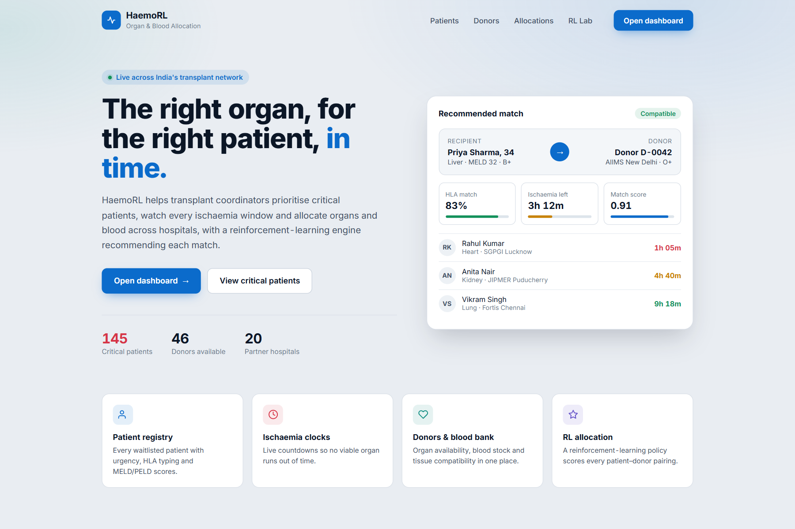
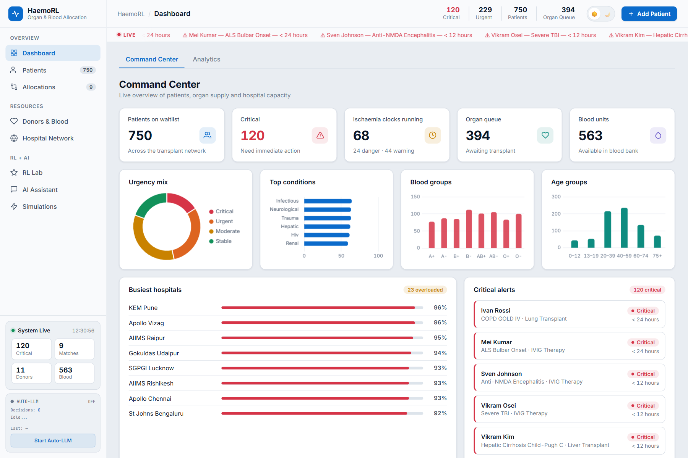
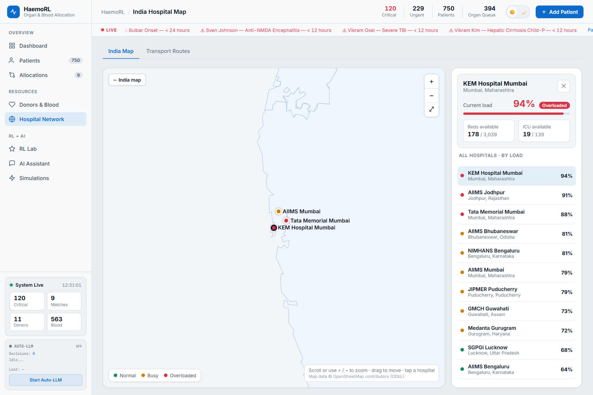
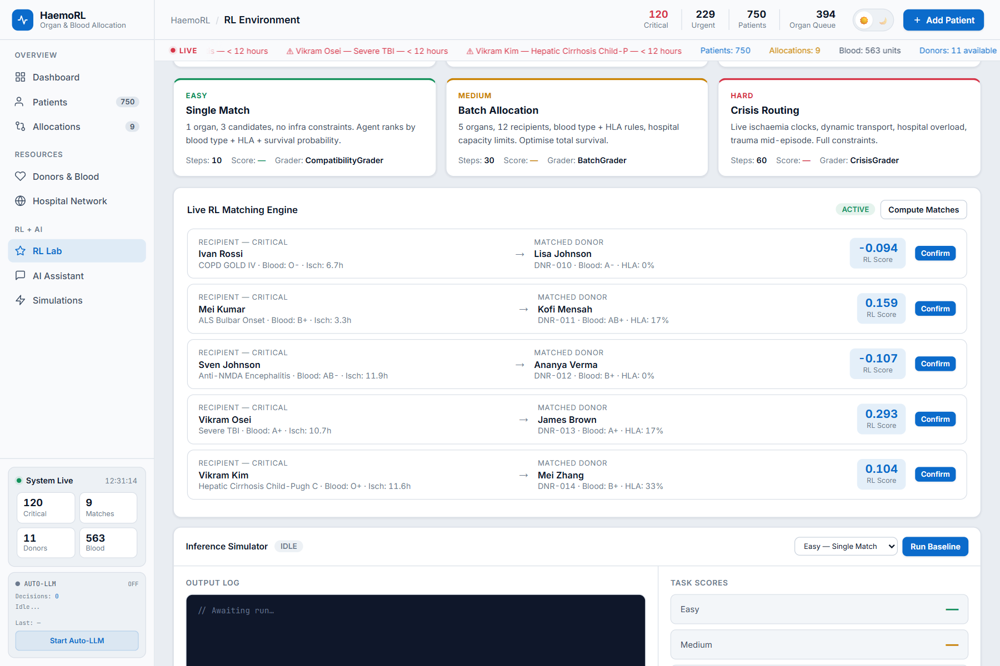
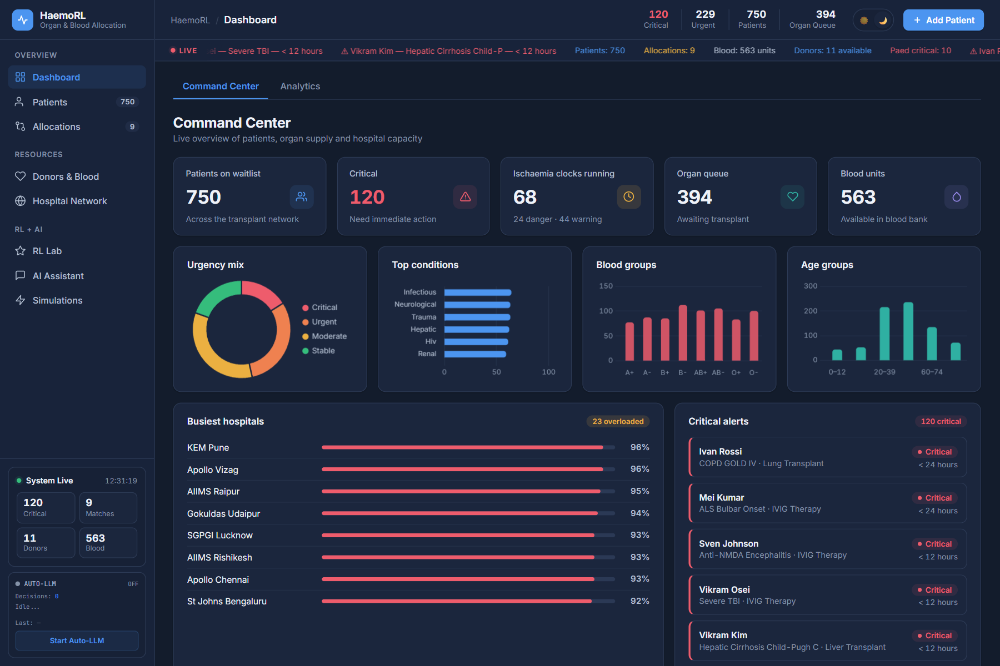

# HaemoRL — Smart Organ Allocation for India

**India loses viable organs to delays. HaemoRL tracks every ischaemia clock and uses RL to route
each organ to the right patient and hospital.**



## The problem

A donor heart stays viable for about **4 hours** outside the body; a liver for about **12**.
Within that window a transplant coordinator has to weigh blood group, tissue match, urgency,
hospital capacity and distance, often by hand and across dozens of hospitals. When the clock
wins, a viable organ is lost.

## What HaemoRL does

HaemoRL is a command center for organ and blood allocation across India's transplant network.

- **Live overview:** critical patients, running ischaemia clocks, organ queue, blood stock and
  the busiest hospitals on one calm screen.
- **Ischaemia clocks:** every critical patient has a countdown, and every lapsed organ offer is
  recorded, so no loss goes unnoticed.
- **Smart matching:** a reinforcement-learning environment scores every
  patient → donor → hospital pairing, and an agent recommends the best one.
- **India Hospital Network:** an interactive map drawn to India's official boundary. Zoom into
  any of the 20 transplant centres to see live load, free beds and ICU capacity.
- **Donors, blood bank and HLA matrix:** organ availability, blood stock and 6-antigen tissue
  compatibility in one place.
- **Kidney paired exchange:** finds 2-way and 3-way swap chains for incompatible living-donor
  pairs.
- **AI assistant (optional):** explains decisions and answers clinical questions. Without an
  LLM configured, a deterministic rule-based engine runs everything.





## How the matching works

HaemoRL exposes a standard RL environment: **reset → step → grade**. The agent observes the
waitlist, the donors and hospital load, then acts by choosing a patient, a donor and a hospital.

| Task               | Difficulty | Steps | Challenge                                            |
|--------------------|------------|-------|------------------------------------------------------|
| `single_match`     | Easy       | 10    | One critical patient → best compatible donor         |
| `batch_allocation` | Medium     | 30    | Five patients, five donors, full medical constraints |
| `crisis_routing`   | Hard       | 60    | Live clocks, trauma arrivals, overloaded hospitals   |

Each decision earns a shaped reward in [−1, 1] built from eight clinical factors:

| Component          | What it rewards or penalises                                 |
|--------------------|--------------------------------------------------------------|
| Blood              | ABO/Rh compatibility                                         |
| HLA                | 6-antigen tissue match                                       |
| Ischaemia          | Urgency of the patient's clock                               |
| Paediatric         | NOTTO paediatric priority, with a PELD bonus                 |
| Hospital load      | Spare capacity and ICU availability                          |
| Survival           | Estimate from age, MELD/PELD, CD4, EF, FEV1                  |
| Geography          | Shorter transport distance                                   |
| Expiry             | Organs lost to delay (capped penalty)                        |

**Results.** Average reward per step over three episodes:

| Policy                          | Avg reward |
|---------------------------------|------------|
| Composite (HaemoRL agent)       | **+0.56**  |
| Urgency-only heuristic          | +0.29      |
| Random                          | +0.02      |

The full environment contract is in [`openenv.yaml`](openenv.yaml), and an example agent is in
[`inference.py`](inference.py).



## Built with

Python · FastAPI · Pydantic · httpx · WebSockets · JavaScript · Chart.js · SVG · GeoJSON · pytest · Docker

## Project structure

```
app.py          API server and web app
core/           medical reference data, database, seeding
services/       reward engine and graders, LLM client, live updates
routes/         patients, donors, allocations, RL, AI, system endpoints
index.html      the web interface
inference.py    example RL agent
openenv.yaml    environment specification
tests/          automated tests
```

## Run it yourself

Requires Python 3.11+.

```bash
pip install -r requirements.txt
python app.py
```

To enable the AI assistant, set `LLM_BASE_URL`, `LLM_MODEL` and `LLM_API_KEY` for any
chat-completions API. Run the tests with `pytest`, or build the included `Dockerfile`.



## Roadmap

- Connect every page to live hospital data (some views still use demo data).
- Secure logins with coordinator and admin roles.
- A full audit trail of every allocation decision (who, when and why), as NOTTO compliance requires.
- A production database, and a trained policy learned on the environment.
- A pilot with a regional transplant network (ROTTO/SOTTO).

## Credits

India state boundaries follow the official Government of India depiction, from
[Vardhan Maps](https://github.com/Vardhan-Systems/vardhan-maps) (© OpenStreetMap contributors, ODbL).
Patient and donor records in this project are synthetic.
